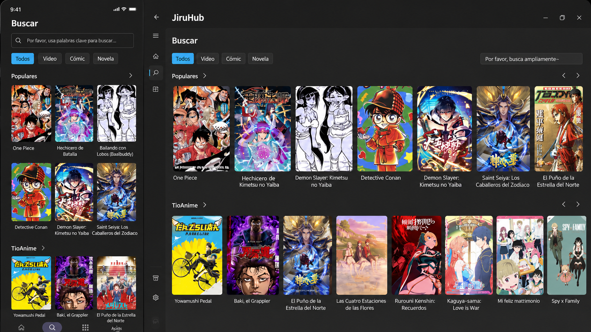

# JiruHub Extensions Repository

**English** | [Español](./README-ES.md)

<div align="center">


# JiruHub

### Repositorio oficial de extensiones para JiruHub

Aplicación multiplataforma enfocada en anime, manga y películas en español mediante un sistema de extensiones.

<p align="center">
  Fork personalizado basado en <b>Miru App</b>, optimizado para la comunidad hispanohablante.
</p>

<br>

[](https://github.com/jephersonRD/JiruHub)
[](LICENSE)
[](https://github.com/jephersonRD/JiruHub/stargazers)
[](https://github.com/jephersonRD/JiruHub/issues)

</div>

---


---

# ✨ ¿Qué es JiruHub?

JiruHub es una versión personalizada y modificada de **Miru App**, diseñada específicamente para usuarios de habla hispana.

El proyecto busca ofrecer una experiencia más limpia, rápida y enfocada en contenido en español mediante un sistema flexible de extensiones.

## ✅ Con JiruHub puedes

- Ver anime online
- Acceder a películas y series
- Utilizar múltiples fuentes desde una sola aplicación
- Instalar extensiones fácilmente
- Crear tus propias extensiones en JavaScript

# JiruHub Installer


### Linux 
<p align="left">
  
  
```bash
curl -fsSL https://raw.githubusercontent.com/jephersonRD/JiruHub/main/jiru-install/install.sh | bash
```

### Windows (PowerShell)


```powershell
irm https://raw.githubusercontent.com/jephersonRD/JiruHub/main/jiru-install/install.ps1 | iex
```

## Assets esperados en GitHub Releases

El instalador busca automáticamente estos assets en la última release:

| Plataforma | Asset |
|-----------|-------|
| Linux x64 | `JiruHub-<tag>-linux-x64.tar.gz` o `JiruHub-<tag>-linux.tar.gz` |
| Linux arm64 | `JiruHub-<tag>-linux-arm64.tar.gz` |
| Windows x64 | `JiruHub-<tag>-windows-x64.zip` o `JiruHub-<tag>-windows.zip` |


# 📦 Cómo agregar este repositorio

1. Abre **JiruHub**
2. Navega a:

```txt
Ajustes → Extensiones → Repositorios
```

3. Presiona el botón **+**
4. Agrega esta URL:

```txt
https://raw.githubusercontent.com/jephersonRD/JiruHub/main/index.json
```

5. Presiona **Recargar**
6. ¡Listo! 🎉

Ahora tendrás acceso a todas las extensiones disponibles.

---

# 📁 Estructura del proyecto

```txt
JiruHub/
├── index.json
├── README.md
├── README-ES.md
├── extensions/
│   ├── animeflv.js
│   ├── animeonlineninja.js
│   ├── cuevana3.js
│   └── tioanime.js
├── assets/
│   ├── icon/
│   │   └── logo.png
│   └── screenshot/
│       └── screenshot.webp
├── icons/
│   ├── animeflv.png
│   ├── animeonlineninja.png
│   ├── cuevana3.png
│   └── tioanime.png
└── .github/
    └── workflows/
        └── pages.yml
```

---

# 🧩 Desarrollo de extensiones

Cada archivo `.js` dentro de `extensions/` representa una extensión independiente.

Las extensiones utilizan JavaScript para obtener y procesar información de sitios web compatibles con el ecosistema Miru.

## 📌 Funciones requeridas

| Función | Descripción |
|----------|-------------|
| `latest(page)` | Obtiene los últimos contenidos agregados |
| `search(kw, page, filter)` | Realiza búsquedas con palabras clave y filtros |
| `detail(url)` | Obtiene información detallada de un contenido |
| `watch(url)` | Obtiene enlaces de reproducción válidos |


---

# 📜 Licencia

Este proyecto está bajo la licencia **AGPL-3.0**.

---

# 🌐 Comunidad

- 🐛 Issues: https://github.com/jephersonRD/JiruHub/issues

---

<div align="center">

## ❤️ Hecho con amor para la comunidad hispanohablante

### JiruHub — Tu puerta de entrada al entretenimiento en español

</div>
